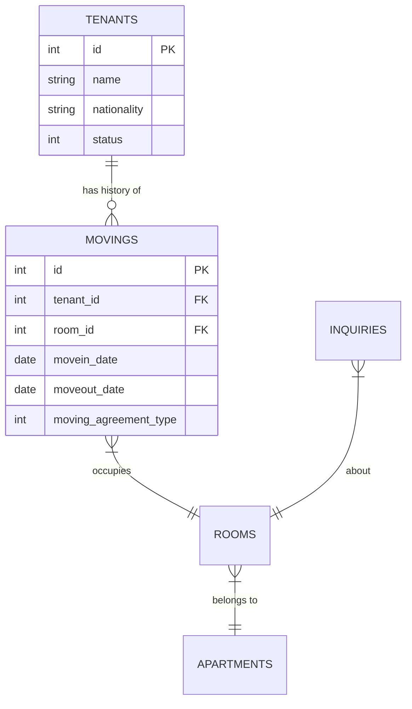

# Data Model & Schema

**Last Updated:** February 14, 2026

This document defines the data model, schema relationships, business logic, and data quality rules for the TokyoBeta Data Consolidation project.

---

## 📚 Table of Contents
1. [Schema Overview](#schema-overview)
2. [Key Tables & Relationships](#key-tables--relationships)
3. [Business Logic & Patterns](#business-logic--patterns)
4. [Data Dictionary](#data-dictionary)
5. [Data Quality & Deduplication](#data-quality--deduplication)
6. [Enrichment (LLM)](#enrichment-llm)

---

## Schema Overview

The database uses a 3-layer architecture:

1. **`staging`**: Raw data loaded directly from SQL dumps. 1:1 copy of source.
2. **`silver`**: Cleaned, deduplicated, and enriched data. The "Source of Truth" for analytics.
3. **`gold`**: Aggregated business metrics and dimension tables optimized for QuickSight.

### Entity Relationship Diagram (Simplified)


---

## Key Tables & Relationships

### 1. Tenant-Moving Relationship (CRITICAL)

**The join method depends on the query purpose:**

#### A. For CURRENT tenant-room assignments (Snapshot)
Use `tenant.moving_id` which points to the **current/primary** room assignment.
```sql
FROM staging.tenants t
INNER JOIN staging.movings m ON t.moving_id = m.id
WHERE t.status IN (target_statuses)
```
- **Use Case:** Active tenant count, current occupancy, `tokyo_beta_tenant_room_info`.
- **Why:** 1 tenant → 1 current moving. No deduplication needed.
- **Exception (Flash Report D5 fact-aligned mode):** `scripts/flash_report_fill` intentionally uses
  `m.tenant_id = t.id` plus tenant-room dedupe and room-priority selection to align the operational
  flash-report benchmark at `2026-02-01 00:00 JST`.

#### B. For ALL movings/contracts (Historical)
Use `moving.tenant_id` which captures **all** history.
```sql
FROM staging.movings m
INNER JOIN staging.tenants t ON m.tenant_id = t.id
WHERE <date_filters>
```
- **Use Case:** Move-in/out analysis, contract history, `int_contracts`.
- **Why:** 1 tenant → many movings. **MUST deduplicate** (see Data Quality section).

### 2. Property Hierarchy
`Apartments` (Buildings) → `Rooms` (Units)
- Join: `rooms.apartment_id = apartments.id`

---

## Business Logic & Patterns

### Contract Types
**NEVER use `tenant.contract_type`**. It was consolidated in Sept 2025.
**ALWAYS use `moving.moving_agreement_type`**.

| Code | Meaning |
|------|---------|
| 1 | General (一般) |
| 2 | Corporate Multi-room (法人契約) |
| 3 | Corporate Individual (法人契約-個人) |
| 7 | General w/ Guarantor (一般-保証会社) |
| 9 | General 2 (一般2) |

### Tenant Status Tracking (SCD Type 2)
We track tenant status changes over time in `gold.tenant_status_transitions`.

**Status Codes:**
- `1`: Active (入居中)
- `2`: Move-out Notice (退去申請中)
- `3`: Moved Out (退去済み)
- `4`: Cancelled (キャンセル)

**Logic:**
- Changes are detected daily by comparing `staging.tenants` snapshots.
- `valid_from` and `valid_to` columns define the effective period of each status.

### Inquiry Counting Logic
**Critical Issue (Feb 2026):**
Duplicate inquiries were inflating counts by ~300%.
**Fix:**
- Use `DISTINCT inquiry_id` when joining with `inquiry_details`.
- Filter out internal test records (e.g., email domains like `@gghouse.co.jp`).

---

## Data Dictionary

### `tokyo_beta_tenant_room_info`
The master view for tenant-room details.

| Field | Description | Source |
|-------|-------------|--------|
| `tenant_id` | Unique tenant ID | `tenants.id` |
| `tenant_name` | Tenant full name | `tenants.name` |
| `room_id` | Unique room ID | `rooms.id` |
| `room_name` | Room number/name | `rooms.name` |
| `house_name` | Building name | `apartments.name` |
| `movein_date` | Contract start date | `movings.movein_date` |
| `moveout_date` | Contract end date | `movings.moveout_date` |
| `actual_moveout_date` | Physical move-out | `movings.actual_moveout_date` |
| `nationality` | Enriched nationality | `tenants.nationality` (or LLM) |
| `age` | Tenant age | Calculated from `birthdate` |
| `gender` | Tenant gender | `tenants.gender` |
| `job_type` | Occupation category | `tenants.job_type` |

---

## Gold Marts for Evidence Dashboards (Weekly-First)

These gold tables power the Evidence dashboard experience (fact vs projection boundary, mapping, and weekly move profiling).

### Occupancy

| Table | Grain | Purpose |
|-------|-------|---------|
| `gold.occupancy_kpi_meta` | 1 row | As-of snapshot date + freshness signals for Fact vs Projection styling |
| `gold.occupancy_daily_metrics` | 1 row / day | Portfolio occupancy KPIs (includes future projections) |
| `gold.dim_property` | 1 row / property | Property attributes + validated coordinates |
| `gold.occupancy_property_daily` | 1 row / (day, property) | Daily property occupancy (facts from snapshots) |
| `gold.occupancy_property_map_latest` | 1 row / property | Latest snapshot + 7-day deltas for map rendering |

### Move-In / Move-Out Profiling

| Table | Grain | Purpose |
|-------|-------|---------|
| `gold.movein_analysis` | 1 row / contract | Move-in enrichment (rent/age buckets, lead-time, geo) |
| `gold.moveout_analysis` | 1 row / contract | Move-out enrichment (rent/age/tenure buckets, reasons, geo) |
| `gold.move_events` | 1 row / (event_type, contract) | Unified move-in + move-out events with Monday week buckets |
| `gold.move_events_weekly` | 1 row / (week, segment) | Weekly cube for dashboards |
| `gold.municipality_churn_weekly` | 1 row / (week, municipality) | Weekly move-in/move-out net change by municipality |
| `gold.property_churn_weekly` | 1 row / (week, property) | Weekly move-in/move-out net change by property |
| `gold.moveouts_reason_weekly` | 1 row / (week, reason, segment) | Weekly move-out counts by reason |

---

## Data Quality & Deduplication

### Duplicate Moving Records
**Issue:** `staging.movings` has ~3,500 duplicate historical records (old unclosed contracts).
**Solution:** Mandatory deduplication pattern in Silver layer.

```sql
WITH deduplicated_movings AS (
  SELECT 
    m.*,
    ROW_NUMBER() OVER (
      PARTITION BY m.tenant_id, m.apartment_id, m.room_id 
      ORDER BY m.movein_date DESC, m.updated_at DESC, m.id DESC
    ) as rn
  FROM staging.movings m
)
SELECT * FROM deduplicated_movings WHERE rn = 1
```

### Data Freshness SLA
| Table | Max Age | Alert Level |
|-------|---------|-------------|
| `staging.movings` | 1 day | CRITICAL |
| `staging.tenants` | 1 day | CRITICAL |
| `gold.*` | 1 day | CRITICAL |

---

## Enrichment (LLM)

### Nationality Enrichment
**Problem:** ~1,600 tenants have missing or invalid (e.g., "Lesotho" default) nationality data.
**Solution:** AWS Bedrock (Claude 3 Haiku) infers nationality from name and other metadata.

**Workflow:**
1. Identify records with missing/invalid nationality.
2. Send to Bedrock: "Guess nationality for name: {name}, language: {lang}".
3. Store result in `staging.tenants.llm_nationality`.
4. Silver layer logic: `COALESCE(llm_nationality, original_nationality)`.

**Accuracy:** ~92% accuracy in tests.
**Cost:** <$0.50/month (incremental processing).
