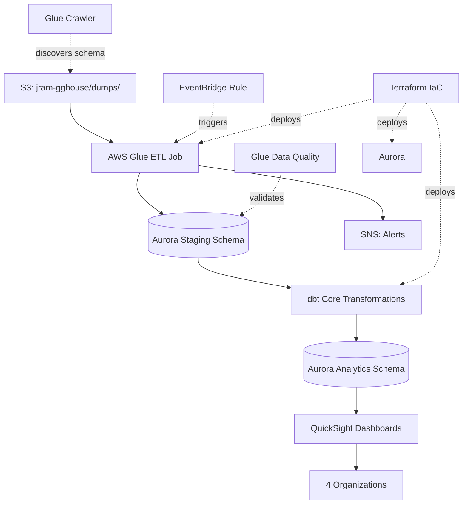

# Updated Architecture: AWS Glue + dbt

## Architecture Diagram



## Components

### 1. AWS Glue ETL Job (PySpark)
**Purpose**: Download S3 dump, parse SQL, load to Aurora staging

**Steps**:
1. Download latest `gghouse_YYYYMMDD.sql` from S3
2. Parse SQL dump (CREATE TABLE + INSERT statements)
3. Create/update staging schema tables
4. Bulk load data into `staging.*` schema
5. Run Glue Data Quality checks
6. Archive processed dump to `s3://jram-gghouse/processed/`

**Configuration**:
- **Worker Type**: G.1X (4 vCPU, 16GB RAM)
- **Number of Workers**: 2
- **Timeout**: 60 minutes
- **Trigger**: EventBridge daily at 7:00 AM JST

### 2. Glue Data Quality Rules
**Rulesets** (applied before dbt transforms):

```python
# movings table rules
rules = [
    "RowCount > 1000",  # Ensure data loaded
    "IsComplete movein_date",  # At least 80% non-NULL
    "ColumnValues movein_date <= moveout_date where moveout_date is not null",  # Logic check
    "Uniqueness id > 0.99",  # Primary key check
    "ReferentialIntegrity tenant_id tenants.id > 0.95"  # FK check
]
```

### 3. dbt Project Structure
```
dbt/
├── dbt_project.yml              # Project config
├── profiles.yml                 # Aurora connection (uses env vars)
├── models/
│   ├── staging/                 # Source definitions
│   │   ├── _sources.yml        # Define staging.* tables
│   │   └── stg_movings.sql     # Clean staging data
│   ├── intermediate/            # Business logic layers
│   │   ├── int_contracts.sql
│   │   └── int_moveouts.sql
│   └── analytics/               # Final 4 tables
│       ├── daily_activity_summary.sql
│       ├── new_contracts.sql
│       ├── moveouts.sql
│       └── moveout_notices.sql
├── tests/
│   ├── assert_no_null_dates.sql
│   ├── assert_valid_date_logic.sql
│   └── assert_referential_integrity.sql
├── macros/
│   ├── clean_string_null.sql   # Macro: 'NULL' → NULL
│   └── safe_date_coalesce.sql  # Macro: moveout date logic
└── seeds/
    └── asset_geocoding.csv      # Manual overrides for geocoding
```

### 4. dbt Models (Example)

**`models/analytics/daily_activity_summary.sql`**:
```sql
{{
  config(
    materialized='table',
    indexes=[
      {'columns': ['activity_date'], 'type': 'btree'}
    ]
  )
}}

WITH active_contracts AS (
    SELECT
        DATE(movein_decided_date) as activity_date,
        CASE 
            WHEN contract_type IN (2, 3) THEN 'corporate'
            ELSE 'individual'
        END as tenant_type,
        COUNT(*) as contract_count
    FROM {{ source('staging', 'movings') }}
    WHERE movein_decided_date IS NOT NULL
      AND cancel_flag = 0
    GROUP BY DATE(movein_decided_date), tenant_type
),

moveouts AS (
    SELECT
        DATE({{ clean_moveout_date('moveout_date', 'moveout_plans_date') }}) as activity_date,
        CASE 
            WHEN contract_type IN (2, 3) THEN 'corporate'
            ELSE 'individual'
        END as tenant_type,
        COUNT(*) as moveout_count
    FROM {{ source('staging', 'movings') }}
    WHERE {{ clean_moveout_date('moveout_date', 'moveout_plans_date') }} IS NOT NULL
      AND is_moveout = 1
    GROUP BY DATE({{ clean_moveout_date('moveout_date', 'moveout_plans_date') }}), tenant_type
)

SELECT
    COALESCE(ac.activity_date, mo.activity_date) as activity_date,
    COALESCE(ac.tenant_type, mo.tenant_type) as tenant_type,
    COALESCE(ac.contract_count, 0) as new_contracts,
    COALESCE(mo.moveout_count, 0) as moveouts,
    COALESCE(ac.contract_count, 0) - COALESCE(mo.moveout_count, 0) as net_occupancy_change
FROM active_contracts ac
FULL OUTER JOIN moveouts mo
    ON ac.activity_date = mo.activity_date
    AND ac.tenant_type = mo.tenant_type
```

**`tests/analytics/assert_no_future_dates.sql`**:
```sql
-- Test: Ensure no activity dates in the future
SELECT *
FROM {{ ref('daily_activity_summary') }}
WHERE activity_date > CURRENT_DATE
```

### 5. Deployment Flow

```bash
# 1. Glue ETL runs daily (7:00 AM JST)
# Loads raw dump → staging schema

# 2. Glue triggers dbt (via Python shell or Lambda)
cd /opt/dbt && dbt run --profiles-dir . --target prod

# 3. dbt transforms staging → analytics
# Creates/updates 4 tables

# 4. QuickSight SPICE refresh (8:00 AM JST)
# Pulls latest analytics data
```

## Updated Terraform Modules

**New modules**:
- `terraform/modules/glue/` - Glue jobs, crawlers, data quality
- `terraform/modules/dbt/` - S3 bucket for dbt artifacts, IAM for Glue to run dbt

**Removed**:
- ~~`terraform/modules/lambda/`~~ (replaced by Glue)

**Updated**:
- `terraform/modules/eventbridge/` - Now triggers Glue instead of Lambda

## Cost Breakdown (Updated)

| Component | Monthly Cost |
|-----------|--------------|
| Aurora MySQL (2 x db.t4g.medium) | $120 |
| AWS Glue ETL (daily runs) | $60-80 |
| dbt Core (self-hosted) | $0 |
| QuickSight Enterprise (5 users) | $90 |
| Data Transfer & Storage | $15 |
| **Total** | **$285-305/month** |

**vs Original Lambda plan**: +$60-80/month (+26% increase)

## Implementation Timeline

- **Week 1**: Terraform modules (Glue, dbt, Aurora)
- **Week 2**: dbt models + tests for 4 analytics tables
- **Week 3**: Glue ETL script development
- **Week 4**: QuickSight dashboards + testing
- **Week 5**: User training + production deployment

## Success Criteria

1. ✅ All dbt models have ≥ 80% test coverage (per .cursorrules)
2. ✅ Glue Data Quality rules pass 100% on daily runs
3. ✅ ETL completes in < 30 minutes daily
4. ✅ QuickSight dashboards load in < 5 seconds
5. ✅ Zero manual interventions for 30 consecutive days
